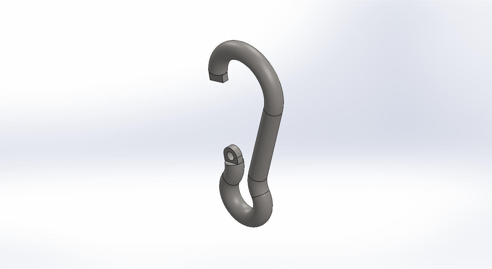
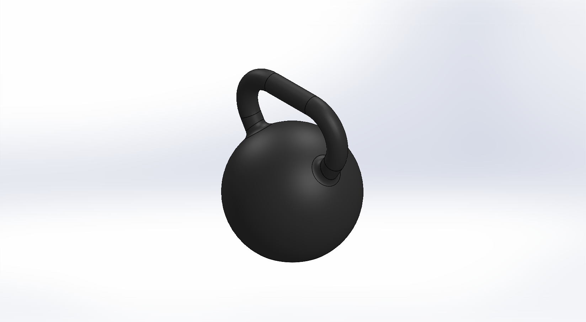
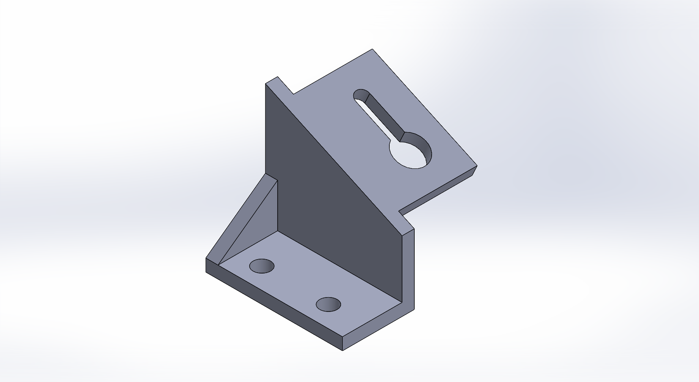
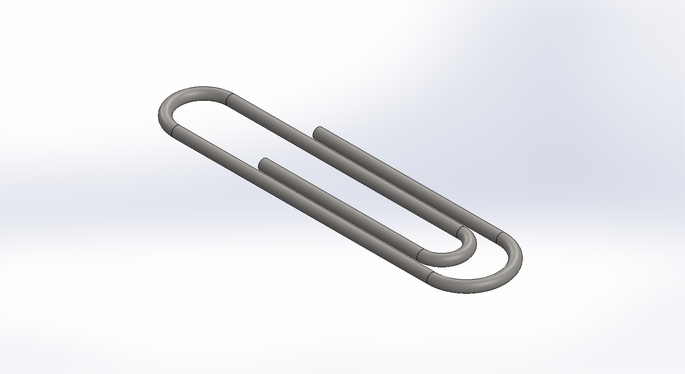
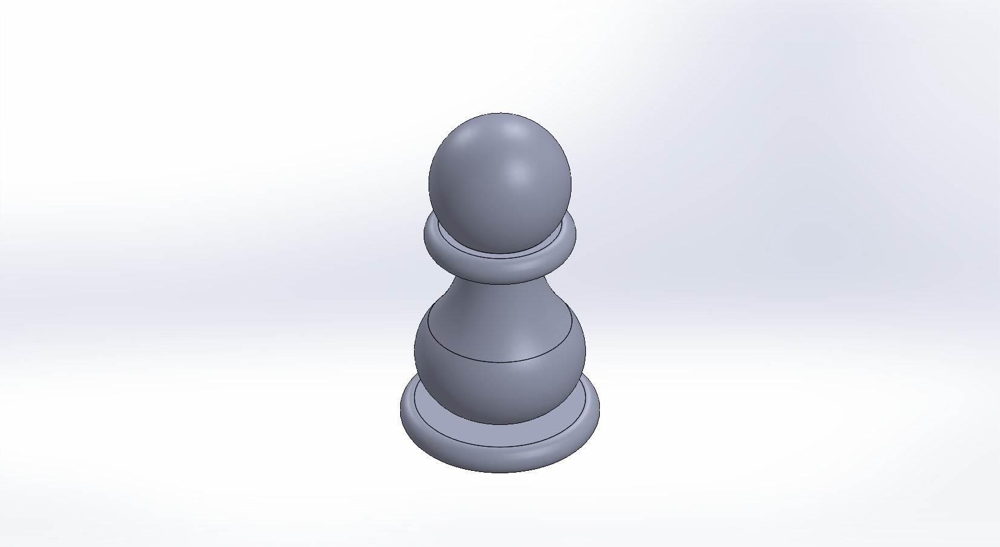
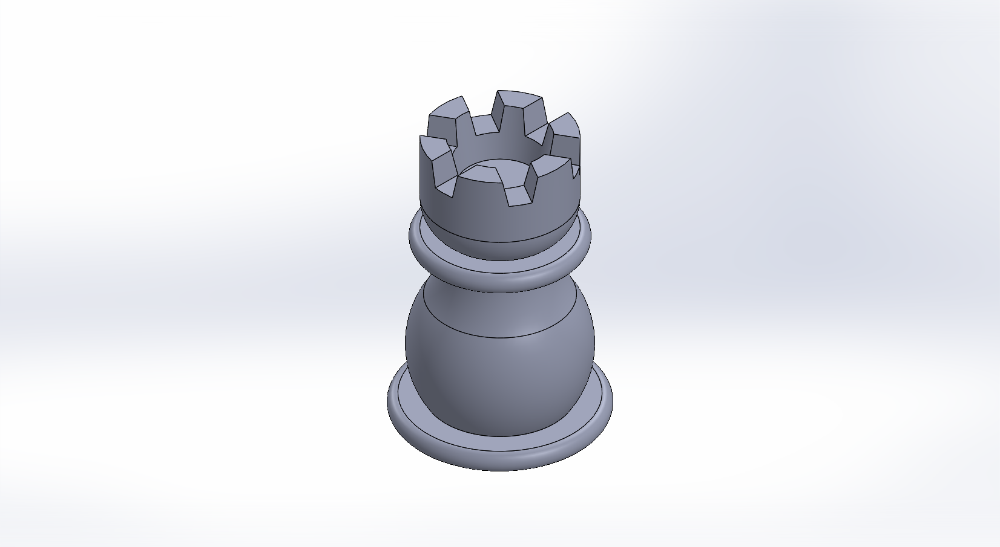

# SOLIDWORKS-Files
A collection of SolidWorks models and assemblies created throughout my Mechanical Engineering degree at Trinity College Dublin.

### 1. Angled Bracket
* **File:** `Angled Bracket.SLDPRT`
* **Preview:** 

### 2. Base Plate
* **File:** `Base Plate.SLDPRT`
* **Preview:** 

### 3. Bolted Flange Disc
* **File:** `Bolted Flange Disc.SLDPRT`
* **Preview:** 

### 4. Carabiner
* **File:** `Carabiner.SLDPRT`
* **Preview:** 

### 5. Cotter Pin
* **File:** `Cotter Pin.SLDPRT`
* **Preview:** 

### 6. Dimpled Tray
* **File:** `Dimpled Tray.SLDPRT`
* **Preview:** 

### 7. Domed Bracket
* **File:** `Domed Bracket.SLDPRT`
* **Preview:** 

### 8. Dotted Pad
* **File:** `Dotted Pad.SLDPRT`
* **Preview:** 

### 9. Hex Bit
* **File:** `Hex Bit.SLDPRT`
* **Preview:** 

### 10. Kettlebell
* **File:** `Kettlebell.SLDPRT`
* **Preview:** 

### 11. L-Bracket
* **File:** `LBracket.SLDPRT`
* **Preview:** 

### 12. Mounting Plate
* **File:** `Mounting Plate.SLDPRT`
* **Preview:** 

### 13. Paperclip
* **File:** `Paperclip.SLDPRT`
* **Preview:** 

### 14. Pawn
* **File:** `Pawn.SLDPRT`
* **Preview:** 

### 15. Pipe Bracket
* **File:** `Pipe Bracket.SLDPRT`
* **Preview:** 

### 16. Pipe Flange Fitting
* **File:** `Pipe Flange Fitting.SLDPRT`
* **Preview:** 

### 17. Rack Gear
* **File:** `Rack Gear.SLDPRT`
* **Preview:** 

### 18. Ribbed Plate
* **File:** `Ribbed Plate.SLDPRT`
* **Preview:** 

### 19. Rook
* **File:** `Rook.SLDPRT`
* **Preview:** 

### 20. Slotted Bracket
* **File:** `Slotted Bracket.SLDPRT`
* **Preview:** 
